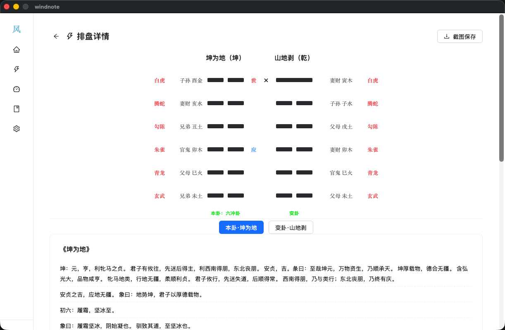

# 风筮 (Windnote)

风筮是一款基于《易经》的桌面占卜应用，支持**六爻起卦**和**梅花易数**两种传统占卜方法。内置六十四卦解卦库，帮助用户在决策困惑时寻求指引。

> 心诚则灵，遇事不决问东风。

## 功能

### 六爻起卦
- **自动起卦**：基于时间种子自动生成六爻
- **手动起卦**：逐爻选择（少阴、少阳、老阴、老阳）
- 支持**变卦**计算，自动推演本卦与变卦
- 显示纳甲、六亲、六神等传统信息
- 卦象截图保存

### 梅花易数
- **数字起卦**：输入 3 位数字，自动计算上卦、下卦与动爻
- **手动起卦**：逐爻设定，支持指定动爻
- **时辰加成**：可选是否用时序数参与计算
- 体用生克分析

### 解卦库
- 六十四卦完整收录
- 支持卦名、卦象搜索
- 每卦配有卦辞、彖传、象传等原文

### 今日黄历
- 首页展示当前日期信息（公历、农历、干支、生肖）
- 宜忌、财神方位等信息

## 截图预览

| 首页 | 六爻详情 | 梅花详情 |
|:---:|:--------:|:--------:|
|  |  |  |

## 技术栈

### 框架
- **桌面壳**：[Wails v2](https://wails.io/) — Go 驱动的原生桌面应用框架
- **前端**：React 18 + React Router v6
- **后端**：Go (Wails Bind)

### 前端依赖
| 依赖 | 用途 |
|------|------|
| [Ant Design 6](https://ant.design/) | UI 组件库 |
| [@ant-design/icons](https://github.com/ant-design/ant-design-icons) | 图标集 |
| [Zustand](https://github.com/pmndrs/zustand) | 轻量状态管理 |
| [Vite 5](https://vitejs.dev/) | 前端构建工具 |
| [Tailwind CSS 3](https://tailwindcss.com/) | 原子化 CSS |
| [Framer Motion](https://www.framer.com/motion/) | 页面动画 |
| [html-to-image](https://github.com/bubkoo/html-to-image) | 卦象截图导出 |

### 后端
- **Go 1.23+**
- **Wails v2.12** — 提供系统文件对话框、窗口管理等原生能力

## 快速开始

### 前置要求
- Go 1.23+
- Node.js 18+
- [Wails CLI](https://wails.io/docs/gettingstarted/installation)
- [Deno](https://deno.com/)（本项目使用 Deno 管理前端依赖）

### 安装与运行

```bash
# 安装 Wails CLI（如未安装）
go install github.com/wailsapp/wails/v2/cmd/wails@latest

# 开发模式运行（热重载）
wails dev

# 构建生产版本
wails build
```

开发模式下：
- 前端 Vite 开发服务器提供热重载，默认端口 **34115**
- Go 后端与前端通过 Wails Bind 通信

## 项目结构

```
windnote/
├── main.go              # Go 入口，Wails 应用初始化
├── app.go               # Go 后端逻辑（版本、截图、黄历等）
├── wails.json           # Wails 项目配置
├── go.mod / go.sum      # Go 模块依赖
├── frontend/            # React 前端
│   ├── index.html       # HTML 入口
│   ├── vite.config.js   # Vite 配置
│   ├── package.json     # 前端依赖
│   ├── src/
│   │   ├── main.jsx     # React 入口
│   │   ├── App.jsx      # 主应用（路由 + 侧边栏导航）
│   │   ├── pages/
│   │   │   ├── Dashboard.jsx    # 首页（黄历）
│   │   │   ├── LiuYao.jsx       # 六爻起卦
│   │   │   ├── LiuYaoDetail.jsx # 六爻解卦详情
│   │   │   ├── MeiHua.jsx       # 梅花易数
│   │   │   ├── MeiHuaDetail.jsx # 梅花易数解卦详情
│   │   │   ├── Library.jsx      # 解卦库
│   │   │   └── Settings.jsx     # 设置
│   │   ├── components/
│   │   │   └── YaoDisplay.jsx   # 爻线展示组件
│   │   ├── stores/
│   │   │   └── lunarStore.js    # 农历数据状态（Zustand）
│   │   └── values/
│   │       ├── guaMap.js        # 卦象映射
│   │       ├── liushisi-gua.js  # 六十四卦数据
│   │       └── quangua.js       # 全卦数据
│   └── wailsjs/         # Wails 自动生成的 JS Bind
└── build/               # 构建产物配置
```

## 数据来源

- **六十四卦经文**：取自《周易》原文（卦辞、彖传、象传）
- **农历信息**：通过 Go 后端代理请求公开 API 获取实时农历、干支、生肖数据

## 许可

该项目使用 [MIT License](LICENSE)。
